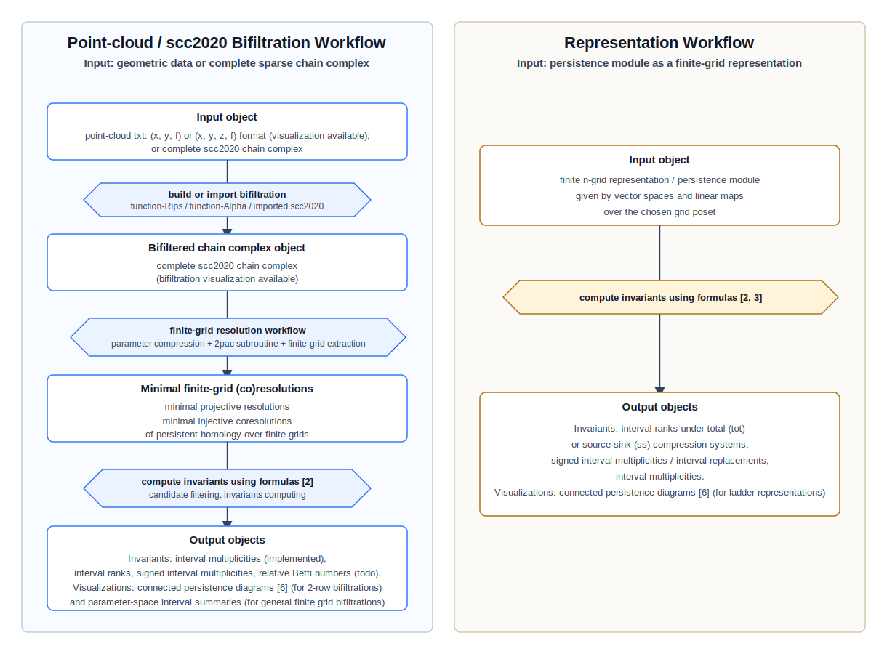

# MPIntInv

<p align="center">
  
</p>

**MPIntInv** stands for **Multiparameter Persistence Interval Invariants**.  It is a Python
project and notebook collection for computing interval-based invariants of
multiparameter persistence modules.  MPIntInv extends the original
implementation for interval replacements of finite-grid representations ([GauthierE/interval-replacement](https://github.com/GauthierE/interval-replacement)) to
workflows that start from point-cloud bifiltrations or from imported finite
chain complexes in the `scc2020` format **[1]**.

The current development focus is two-parameter bifiltrations arising in
topological data analysis.  Given a point cloud with a scalar function, or a
precomputed `scc2020` chain complex, MPIntInv can compute minimal projective
resolutions and minimal injective coresolutions of the resulting persistent
homology over finite grids, and use them to compute interval-based invariants.
The implemented filtration workflow currently includes interval multiplicity
computations **[2]**.  Planned downstream invariants include interval ranks,
signed interval multiplicities, and relative Betti numbers for the same
filtration-based input pipeline.

The repository also keeps the original representation-level workflow, which is
derived from
[GauthierE/interval-replacement](https://github.com/GauthierE/interval-replacement):
users can directly instantiate a persistence module as a representation over an
`n`-dimensional grid and compute interval ranks under the total (`tot`) or
source-sink (`ss`) compression systems of **[3]**, signed interval
multiplicities, and interval multiplicities.

## Workflow Overview



Connected persistence diagram terminology in the workflow overview follows
**[6]**.

## Scope

This code supports two complementary input modes.

1. **Bifiltration inputs.**  A user can start from any one of the following:
   - point-cloud data, converted to a two-parameter `scc2020` chain complex
     using `pointcloud_to_scc2020.py`;
   - an existing complete `scc2020` chain-complex file;
   - a two-parameter filtered simplicial chain complex generated by another
     program, provided it is exported as a complete `scc2020` file with all
     generator grades and boundary matrices.

2. **Finite-grid representations.**  A user can define a persistence module
   directly as a representation of an `n`-dimensional grid quiver.  This is the
   original workflow of the repository and is implemented mainly in `utils.py`,
   `intappx.py`, and the tutorial notebooks.

For the bifiltration mode, this project first compresses the finitely many
parameter values to a finite 2D grid.  It then uses an external, unmodified
`2pac` installation **[4, 5]** as a subroutine and adds finite-grid
compression/coning/extraction steps to compute minimal projective resolutions
and minimal injective coresolutions of persistent homology indexed by the
finite grid.  The resulting minimal resolutions and coresolutions are then used
to compute interval-based invariants on the compressed grid.

## Main Workflows

### 1. Point-cloud and `scc2020` bifiltration workflow

The newer part of MPIntInv supports two-parameter bifiltrations coming from
point-cloud data or from imported chain-complex files.

Point-cloud input is handled by `pointcloud_to_scc2020.py`.  Text files may
contain 2D or 3D coordinates and a scalar function value, for example:

```text
x y f
x y z f
```

The converter currently supports:

- function-Rips bifiltrations, using
  `grade(simplex) = (diameter(simplex), max function value on simplex)`;
- function-Alpha bifiltrations, using GUDHI's `AlphaComplex` when GUDHI is
  installed, with
  `grade(simplex) = (alpha radius, max function value on simplex)`;
- complete `scc2020` output, including the final row-grade block required by
  the finite-grid workflow.  For convenience, the point-cloud converter writes
  these chain complexes over `GF(2)`, the software notation for the finite
  field usually written mathematically as `\mathbb{F}_2`.

Existing `scc2020` chain complexes can also be used directly.  The parser and
finite-grid compression logic are implemented in `finite_grid_cone.py` and
`resolution_compt.py`.

The coefficient-field support of the point-cloud/chain-complex workflow follows
the field support of the external `2pac` installation.  Thus, when starting from
an imported `scc2020` complex with a supported coefficient field, the downstream
finite-grid resolution, coresolution, and interval-invariant computations are
not restricted to `GF(2)`.

The main notebooks for this workflow are:

- `pointcloud_to_scc2020_tutorial.ipynb`, for converting point clouds to
  `scc2020`;
- `resolution_compt.ipynb`, for running the finite-grid presentation and
  resolution pipeline;
- `interval_multiplicities_computations_filtration_2row.ipynb`, for interval
  candidate filtering, interval multiplicity computation, and connected
  persistence diagram visualizations for 2-row bifiltrations;
- `interval_multiplicities_computations_filtration_large_grid.ipynb`, for the
  same interval multiplicity workflow on larger finite grids;
- `pointcloud_bifiltration_visualization.ipynb`, for visualizing point clouds,
  compressed bifiltration grids, and geometric bifiltration panels;
- `pointcloud_bifiltration_visualization_chromatic.ipynb`, for the chromatic
  point-cloud examples.

### 2. Representation-level interval replacement

The representation-level part of this repository descends from
[GauthierE/interval-replacement](https://github.com/GauthierE/interval-replacement)
and implements the interval replacement of a persistence module as described in
**[3]**.  Interval replacements (or signed interval multiplicities) are
computed by Möbius inversion of interval ranks, also known as compression
multiplicities in **[7]**.  The implementation supports interval ranks under
the total (`tot`) and source-sink (`ss`) compression systems of **[3]**, using
the formula in **[3]** through rank computations of linear maps.  Under the
total (`tot`) compression system, this interval rank invariant coincides with
the generalized rank invariant of **[8]**.

In this workflow, users can:

- instantiate a `d`-dimensional grid with the `Representation` class;
- define a representation by assigning vector spaces and linear maps to the
  grid;
- define intervals with the `Interval` class, using source and sink antichains;
- enumerate intervals;
- compute interval ranks under the total (`tot`) or source-sink (`ss`)
  compression system;
- compute interval signed multiplicities and the associated interval
  replacement;
- visualize representations and intervals in 1D and 2D settings.

The notebooks `tutorial-1D-standard.ipynb`, `tutorial-2D-decomposable.ipynb`,
and `tutorial-2D-homogeneous-tube.ipynb` illustrate this workflow.

Related background includes generalized persistence diagrams for modules over
posets **[8]** and interval decomposability of 2D persistence modules **[9]**.

## Computing Invariants From Filtrations

For `scc2020` bifiltration inputs, the implemented downstream computation is a
fast interval multiplicity workflow **[2]**.  The speedup comes from filtering
interval candidates before applying the interval multiplicity formula; this
follows the candidate-pruning strategy developed in Section 3 of **[2]**.

The current implementation includes:

- interval candidate filtering on a compressed finite grid;
- projective-presentation based interval multiplicity computation on the
  retained candidates;
- injective-copresentation based interval multiplicity computation for
  cross-checking;
- comparison of the projective and injective multiplicity results.

The following filtration-based invariants are planned future work:

- interval ranks;
- signed interval multiplicities;
- relative Betti numbers.

## Visualization

The repository provides visualization tools for both representation-level and
filtration-level computations.

For representation inputs, `display.py` contains utilities for visualizing
representations and intervals in 1D and 2D grid settings.

For filtration inputs, `bifiltration_visualization.py` and
`interval_multiplicity_visualization.py` provide:

- point-cloud scatter plots in 2D or 3D, optionally colored by function value;
- compressed-grid visualizations of bifiltration grades;
- panel-style visualizations of geometric simplicial complexes on selected
  compression-grid grades;
- connected persistence diagram (PD) visualizations for 2-row bifiltrations
  **[6]**;
- parameter-space visualizations of interval multiplicity results on general
  finite grids, including overlays and binned summaries.

## External Dependency on `2pac`

The filtration workflow depends on `2pac`; see the original 2pac paper and the
upstream software repository **[4, 5]**.  The original 2pac algorithm computes
minimal free resolutions of two-parameter persistent homology indexed by the
infinite grid `\mathbb{Z}^2`.  Even when an input bifiltration has only
finitely many distinct parameter values and can therefore be compressed to a
finite 2D grid, this is different from directly computing projective
resolutions and injective coresolutions over the finite grid as a finite poset.

MPIntInv uses the unmodified `2pac` executable as an external subroutine
and implements the additional finite-grid workflow needed to compute minimal
projective resolutions and minimal injective coresolutions of persistent
homology indexed by a finite 2D grid.  This repository **does not vendor,
redistribute, or modify `2pac`**.  Users must install `2pac` separately and make
its executable available on their `PATH`, or configure the notebooks/scripts to
point to the installed executable.

Because `2pac` is an external research software package, users are responsible
for:

- following the installation instructions of the upstream `2pac` project;
- checking and complying with the upstream `2pac` license;
- citing `2pac` and the relevant 2-parameter persistence algorithms in any
  academic or public use of results obtained through this pipeline.

The finite-grid wrapper in this repository treats `2pac` as an external command
line tool.  The wrapper writes compatible temporary chain complexes, calls
`2pac`, and then parses and restricts the resulting resolution data for
downstream finite-grid interval computations.

## Installation

The original representation-level implementation mainly depends on SymPy:

```bash
pip install sympy
```

The filtration and visualization notebooks additionally use common scientific
Python packages:

```bash
pip install numpy matplotlib
```

Function-Alpha point-cloud conversion is optional and requires GUDHI:

```bash
pip install gudhi
```

For the full finite-grid bifiltration pipeline, install `2pac` separately
according to its upstream instructions.  This repository assumes a user-managed
installation of `2pac`; it does not install it automatically.

After cloning or downloading this repository, keep the Python files and
notebooks in the same project directory so the notebooks can import the local
helper modules.

## Typical Usage

### Representation input

Open a tutorial notebook such as `tutorial-1D-standard.ipynb`,
`tutorial-2D-decomposable.ipynb`, or `tutorial-2D-homogeneous-tube.ipynb`.
These notebooks show how to define a grid representation, define intervals,
compute interval ranks under the total (`tot`) or source-sink (`ss`)
compression system, and compute signed interval multiplicities.

### Point-cloud bifiltration input

Use `pointcloud_to_scc2020.py` to convert a point-cloud text file to a complete
two-parameter `scc2020` chain complex.  For example:

```bash
python pointcloud_to_scc2020.py rips points.txt output.scc2020.txt --max-dim 2
python pointcloud_to_scc2020.py alpha points.txt output.scc2020.txt --max-dim 2 --alpha-cutoff 5
```

Then use the presentation/resolution notebooks to compute finite-grid
minimal projective resolutions and minimal injective coresolutions, and use
`interval_multiplicities_computations_filtration_2row.ipynb` or
`interval_multiplicities_computations_filtration_large_grid.ipynb` to compute
interval multiplicities **[2]**.

### Imported `scc2020` input

Place the complete `scc2020` chain-complex file in a convenient directory, for
example `data/chain_complex_scc2020/`, and point the presentation and
multiplicity notebooks to that file.  The finite-grid workflow expects complete
`scc2020` files, including the final `C_0` grade block.  The coefficient field
can be any field supported by the installed `2pac` executable and by the input
file format used in the workflow.

## Repository Guide

Important files include:

- `utils.py`: representation and interval classes for the original workflow;
- `intappx.py`: interval hull, source/sink, and interval approximation helpers;
- `display.py`: representation-level visualization helpers;
- `pointcloud_to_scc2020.py`: function-Rips and function-Alpha conversion from
  point-cloud text files to complete `scc2020`;
- `resolution_compt.py`: 2pac-based external-tool wrappers and `scc2020`
  validation for the main finite-grid workflow;
- `finite_grid_cone.py`: finite-grid compression and coning workflow around
  external `2pac` computations;
- `finite_grid_interval_candidates.py`: interval candidate filtering on
  compressed finite grids;
- `intmult_from_filtration.py`: interval multiplicity computations from
  projective presentations or injective copresentations;
- `bifiltration_visualization.py`: point-cloud and bifiltration visualization;
- `interval_multiplicity_visualization.py`: visualization of interval
  multiplicity outputs.

Example input and output data are stored under:

- `data/pointcloud_examples/`;
- `data/chain_complex_scc2020/`;
- `outputs/resolution_computation/`;
- `outputs/interval_candidates/`;
- `outputs/interval_multiplicities/`.

## Contributors and Acknowledgments

MPIntInv is developed by the MPIntInv contributors in connection with ongoing
work on several interval-based invariants for multiparameter persistence.

The current contributors are Hideto Asashiba, Justin Desrochers, Ondřej
Draganov, Kaito Endo, and Etienne Gauthie, listed alphabetically by
family name.

The representation-level workflow builds on the
[GauthierE/interval-replacement](https://github.com/GauthierE/interval-replacement)
repository and the interval replacement framework cited in **[3]**.  The
filtration-level workflow also relies on external research software and file
formats, especially `2pac` **[4, 5]** and `scc2020` **[1]**.

## License and Copyright

Copyright (c) 2026 MPIntInv contributors.

MPIntInv is released under the MIT License.  See [LICENSE](LICENSE) for the
full license text.

Parts of the representation-level workflow are derived from
[GauthierE/interval-replacement](https://github.com/GauthierE/interval-replacement),
developed in connection with the interval replacement work cited in **[3]**.
External software dependencies, including `2pac` and GUDHI, are not vendored or
redistributed by this repository and remain governed by their own licenses.

## Notes and Limitations

- The finite-grid filtration workflow currently targets two-parameter
  bifiltrations.
- The point-cloud-to-`scc2020` converter writes `GF(2)`, i.e.
  `\mathbb{F}_2`, chain complexes as a convenient default.  The broader
  point-cloud/chain-complex workflow can use any coefficient field supported by
  the installed `2pac` executable when the input `scc2020` file is provided
  over that field.
- Function-Alpha conversion requires GUDHI; function-Rips conversion uses the
  Python standard library.
- The finite-grid minimal projective and injective computations use an external
  `2pac` installation as a subroutine, but the finite-grid workflow itself is
  implemented in this repository.
- Representation-level rank computations are currently performed over
  `\mathbb{R}` through the available linear-algebra backend.  Users may adapt the
  rank backend for finite-field computations if needed.

## References

**[1]** Kerber, M., & Lesnick, M. *scc2020: A file format for sparse chain
complexes in TDA.*
[https://bitbucket.org/mkerber/chain_complex_format/](https://bitbucket.org/mkerber/chain_complex_format/) (2021).

**[2]** Asashiba, H., & Liu, E. *Interval Multiplicities of Persistence
Modules.* arXiv preprint
[arXiv:2411.11594](https://arxiv.org/abs/2411.11594) (2024).

**[3]** Asashiba, H., Gauthier, E., & Liu, E. *Interval Replacements of
Persistence Modules.* arXiv preprint
[arXiv:2403.08308](https://arxiv.org/abs/2403.08308) (2024).

**[4]** Bauer, U., Lenzen, F., & Lesnick, M. *Efficient Two-Parameter
Persistence Computation via Cohomology.* In *39th International Symposium on
Computational Geometry (SoCG 2023)*, Leibniz International Proceedings in
Informatics (LIPIcs), Vol. 258, 15:1-15:17, Schloss Dagstuhl - Leibniz-Zentrum
für Informatik (2023).
[https://doi.org/10.4230/LIPIcs.SoCG.2023.15](https://doi.org/10.4230/LIPIcs.SoCG.2023.15).

**[5]** Lenzen, F. *2pac (2-parameter persistent cohomology).* C++ software
package for two-parameter persistent cohomology.
[https://gitlab.com/flenzen/2-parameter-persistent-cohomology](https://gitlab.com/flenzen/2-parameter-persistent-cohomology) (2023).

**[6]** Hiraoka, Y., Nakashima, K., Obayashi, I., & Xu, C. *Refinement of
Interval Approximations for Fully Commutative Quivers.* Japan Journal of
Industrial and Applied Mathematics, 42, 1309-1361 (2025).
[https://doi.org/10.1007/s13160-025-00739-w](https://doi.org/10.1007/s13160-025-00739-w).

**[7]** Asashiba, H., Escolar, E. G., Nakashima, K., & Yoshiwaki, M. *On
Approximation of 2D Persistence Modules by Interval-decomposables.* Journal of
Computational Algebra, Volumes 6-7, 2023, 100007, ISSN 2772-8277,
[https://doi.org/10.1016/j.jaca.2023.100007](https://doi.org/10.1016/j.jaca.2023.100007).

**[8]** Kim, W., & Mémoli, F. *Generalized persistence diagrams for persistence
modules over posets.* Journal of Applied and Computational Topology 5,
533-581 (2021).
[https://doi.org/10.1007/s41468-021-00075-1](https://doi.org/10.1007/s41468-021-00075-1).

**[9]** Asashiba, H., Buchet, M., Escolar, E. G., Nakashima, K., & Yoshiwaki,
M. *On interval decomposability of 2D persistence modules.* Computational
Geometry, Volumes 105-106, 2022, 101879, ISSN 0925-7721.
[https://doi.org/10.1016/j.comgeo.2022.101879](https://doi.org/10.1016/j.comgeo.2022.101879).

When using the filtration workflow, please also cite the upstream `2pac`
software according to its own citation instructions.
